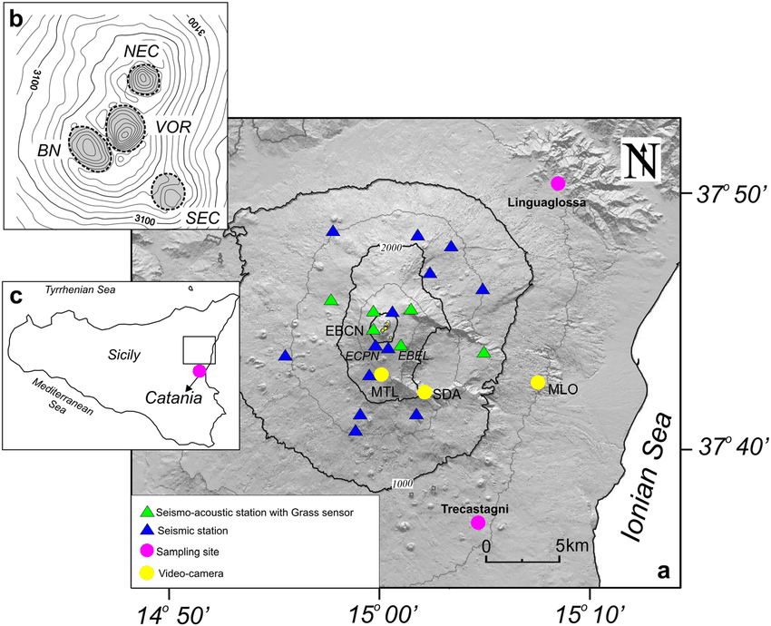

# Seismic volcano monitoring simulation

## Introduction

The following simulation is aimed to introduce a hypothetical scenario of network involved in monitoring seismic data of a volcano and alerting in case of imminent danger. The network simulates a PAN in which every node (the sensors) communicate with a central node (server), like a star topology. Sensor nodes are made of microcontroller, a seismometer and a radio antenna. The network is designed through MQTT protocol, in order to make the sensors the only devices enabled to send information and the server the only node to receive them (publisher-subscriber paradigm). Obviously, it is possible to locate many networks around the volcano, since a single one is not capable of covering the whole surface of the volcano.

## Case Study - Mount Etna

Mount Etna is an active stratovolcano on the East coast of Sicily, Italy. It will be our case study for the simulation and the location of our hypothetical network. In the reality, Etna is daily, hourly monitored through many sensor stations located all around itself. All data is gathered and studied by INGV in order to make possibly reliable previsions of earthquakes and eruptions.

------

## Sensor network and data visualization

The network is inspired by MQTT protocol and therefore provides the user of MQTT Client objects and a MQTT broker, aimed to handle all dependencies between clients. Both publishers and subscribers are equally seen outside such as Clients and the only one knowing the real entity of the request is the broker. Unlike the classic Publisher-Subscriber paradigm, they don't know each other and can't directly send information to the other part.

### Sensors

Sensors inherit attributes and methods from superclass MQTTPublisher that provides:

- a `connect()` method (inherited from MQTTClient) useful for starting the hypothetical connection with the broker
- a `publish()` method, in order to notify all subscribers when new data is collected
- a `getData()` method is declared, and then implemented to let subscribers pull the new data 

So, the order sensors work is:

- firstly, connect to the broker
- then, select the topic they will be notifying for
- finally, collect data and notify the subscribers

### Stations

Stations inherit attributes and methods from superclass MQTTSubscriber that provides:

- a `connect()` method (inherited from MQTTClient) useful for starting the hypothetical connection with the broker
- a `subscribe()` method , in order to let the station select all the topics is interested in
- an `update()` method, working such as a pull method, in order to collect data from publisher

So, the order stations work is:

- firstly, connect to the broker
- then, subscribe to the topic they want to be updated for
- finally, collect all the data the publishers will give them

### Broker

Broker is responsible for receiving messages, filtering them dependently on who is subscribed for, and send them to the right subscribers. It can also provide authentication and authorization of clients.

### Seismic Data

Data has been conventionally represented as a simple class containing as attributes only the time (hour and seconds) in which the data has been collected and the magnitude value of the seismic waves according to Richter scale.

## Conclusions

This is just a simulation aiming to demonstrate how a small sensor network could work in a context like that we have just introduced. Obviously, the real technologies applied for this purpose are more sophisticated and show a major number of informations and details about geological phenomenons, however my first intention is not to deepen into the specific, but to show the general behaviour of the system that stay behind the collection and the sending of data, aiming to apprehend from it for future innovative applications.
